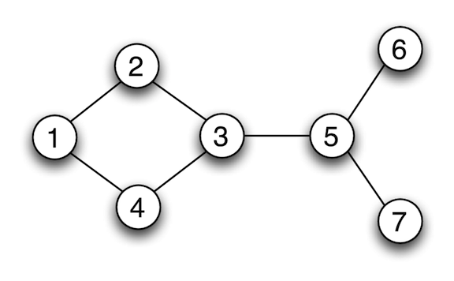
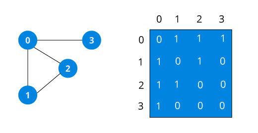

# Graph

<!-- MarkdownTOC -->

- [Definition](#definition)
- [Graph Types](#graph-types)
  - [Undirected Graph](#undirected-graph)
  - [Directed Graph](#directed-graph)
- [Graph Representations](graph-representations)
  - [Adjacency Matrix](#adjacency-matrix)
  - [Adjacency List](#adjacency-list)
- [Applications of Graph](#applications-of-graph)
  - [Topological Sort](#topological-sort)
  - [Union Find](#union-find)
- [References](#references)

<!-- /MarkdownTOC -->

## Definition

Graph is an abstract data type that is meant to implement the **undirected graph** and **directed graph** concepts from the field of graph theory within mathematics.

A graph data structure consists

- a finite (and possibly mutable) set of _vertices_ (also called _nodes_ or _points_)
- a set of unordered pairs of these vertices for an undirected graph or a set of ordered pairs for a directed graph. These pairs are known as _edges_ (also called _links_ or _lines_), and for a directed graph are also known as _arrows_. The edges may contain weight/value/cost.

## Graph Types

### Undirected Graph



A undirected graph is a pair _G = (V, E)_, where _V_ is a set whose elements are called vertices (singular: vertex), and _E_ is a set of two-sets (sets with two distinct elements) of vertices, whose elements are called edges.

The vertices _x_ and _y_ of an edge _{x, y}_ are called the endpoints of the edge. The edge is said to _join x_ and _y_ and to be _incident_ on _x_ and _y_. A vertex may not belong to any edge.

### Directed Graph


In formal terms, a directed graph is an ordered pair G = (V, A) where[1]

- _V_ is a set whose elements are called vertices, nodes, or points;
- _A_ is a set of ordered pairs of vertices, called arrows, **directed** edges.

## Graph Representations

The representation of graph includes two components

- A finite set of vertices
- A finite set of unordered or ordered pair of the form (u, v) as edges

### Adjacency Matrix



Adjacency Matrix is a 2D array of size V x V where V is the number of vertices in a graph. Let the 2D array be adj[][], a slot adj[i][j] = 1 indicates that there is an edge from vertex i to vertex j. Adjacency matrix for undirected graph is always symmetric. Adjacency Matrix is also used to represent weighted graphs. If adj[i][j] = w, then there is an edge from vertex i to vertex j with weight w.


```java
// Undirected graph without weight
class UndirectedGraph {
    private boolean adjMatrix[][];
    private int numVertices;

    UndirectedGraph(int numVertices) {
        this.numVertices = numVertices;
        adjMatrix = new boolean[numVertices][numVertices];
    }
 
    void addEdge(int i, int j) {
        adjMatrix[i][j] = true;
        adjMatrix[j][i] = true;
    }
 
    void removeEdge(int i, int j) {
        adjMatrix[i][j] = false;
        adjMatrix[j][i] = false;
    }
 
    boolean isEdge(int i, int j) {
        return adjMatrix[i][j];
    }
}

// Directed graph with weight
class DirectedGraph {
    private int adjMatrix[][];
    private int numVertices;

    DirectedGraph(int numVertices) {
        this.numVertices = numVertices;
        adjMatrix = new int[numVertices][numVertices];
    }
 
    void addEdge(int src, int dst, int weight) {
        adjMatrix[src][dst] = weight;
    }
 
    void removeEdge(int src, int dst) {
        adjMatrix[src][dst] = 0;
    }
 
    boolean isEdge(int src, int dst) {
        return adjMatrix[src][dst] > 0;
    }
}
```

### Adjacency List


An array of lists is used. Size of the array is equal to the number of vertices. Let the array be array[]. An entry array[i] represents the list of vertices adjacent to the ith vertex. This representation can also be used to represent a weighted graph. The weights of edges can be represented as lists of pairs. Following is adjacency list representation of the above graph.

```java
// Directed graph w/o weight
class DirectedGraph {
    private int numVertices;
    private LinkedList<Integer>[] adjLists;
 
    Graph(int vertices) {
        numVertices = vertices;
        adjLists = new LinkedList<>[vertices];
        
        for (int i = 0; i < vertices; i++)
            adjLists[i] = new LinkedList();
    }

    void addEdge(int src, int dst) {
        adjLists[src].add(dest);
    }
 
    void removeEdge(int i, int j) {
        adjLists[src].remove(dest);
    }
 
    boolean isEdge(int i, int j) {
        return adjLists[src].contains(dest);
    }
```

## Applications of Graph

### BFS

BFS for a graph is similar to BFS for a tree. The only difference is graphs may contain cycles.

```java
// Direct graph with adjacency representation
class Graph {
    private int numVertices;
    private LinkedList<Integer>[] adjLists;

    Graph(int vertices) {
        numVertices = vertices;
        adjLists = new LinkedList<>[vertices];
        
        for (int i = 0; i < vertices; i++)
            adjLists[i] = new LinkedList();
    }

    void addEdge(int src, int dst) {
        adjLists[src].add(dest);
    }

    void BFS(int start) {
        // Mark all the vertices as not visited (By default set as false)
        boolean visited[] = new boolean[V];
        // Create a queue for BFS
        LinkedList<Integer> queue = new LinkedList<Integer>();

        visited[start]=true;
        queue.add(start);

        while (queue.size() != 0){
            int s = queue.poll();
            System.out.print(s + " ");

            Iterator<Integer> i = adjLists[s].listIterator();
            while (i.hasNext()) {
                int n = i.next();
                if (!visited[n]) {
                    visited[n] = true;
                    queue.add(n);
                }
            }
        }
```

```java
// Undirected graph with adjacency matrix representation
class Graph {
    private boolean adjMatrix[][];
    private int numVertices;

    Graph(int numVertices) {
        this.numVertices = numVertices;
        adjMatrix = new boolean[numVertices][numVertices];
    }
 
    void addEdge(int i, int j) {
        adjMatrix[i][j] = true;
        adjMatrix[j][i] = true;
    }
}
```

### DSF

### Topological Sort

### Union Find

## References

- <https://en.wikipedia.org/wiki/Graph_(abstract_data_type)>
- <https://en.wikipedia.org/wiki/Graph_(discrete_mathematics)>
- <https://www.programiz.com/dsa/graph-adjacency-matrix>
- <https://www.programiz.com/dsa/graph-adjacency-list>
