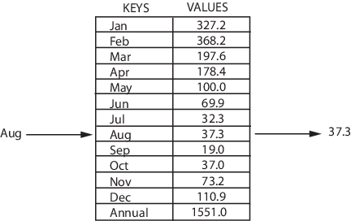
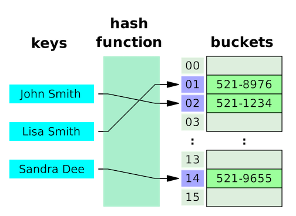
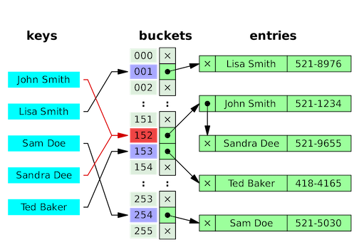
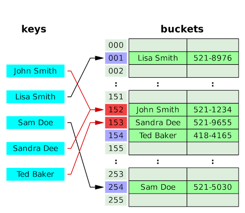

# Map

<!-- MarkdownTOC -->

- [Definition](#definition)
- [HashTable Implementations](#hashtable-implementations)
  - [Hash Function](#hash-function)
  - [Collision](#collision)
- [Map Interface](#map-interface)
  - [Methods in Map](#methods-in-map)
- [HashTable Class](#hashtable-class)
  - [Constructor](#constructor)
- [HashMap Class](#hashmap-class)
- [Tree Implementations](#tree-implementations)
- [TreeMap](#TreeMap)
- [References](#references)

<!-- /MarkdownTOC -->

## Definition

Map, also known as dictionary or associative array, is a collection of _(key, value)_ pairs, such that each possible key appears at most once in the collection.



Operations associated with this data type allow:

- Add or insert: add a new _(key,value)_ pair to the collection, mapping the new key to its new value.
- Reassign: replace the value in one of the _(key,value)_ pairs that are already in the collection, mapping an old key to a new value.
- Remove or delete: remove a _(key,value)_ pair from the collection, unmapping a given key from its value.
- Lookup: find the value (if any) that is bound to a given key.

## HashTable Implementations



The most frequently used general purpose implementation of an associative array or map is with a hash table: an array combined with a _hash function_ that separates each key into a separate "bucket" of the array. The basic idea behind a hash table is that accessing an element via its index is a simple, constant-time operation. Therefore, the average overhead of an operation for a hash table is only the computation of the key's hash, combined with accessing the corresponding bucket within the array. As such, hash tables usually perform in **O(1)** time, and outperform alternatives in most situations.

### Hash Function

Hash function is a function that can be used to map data of arbitrary size to fixed-size values.

```
index = f(key, array_size)
```

A critical statistic for a hash table is the load factor, defined as

```
load_factor = the number of entries occupied in the hash table / the number of buckets
```

As the load factor grows larger, the hash table becomes slower, and it may even fail to work (depending on the method used). The expected constant time property of a hash table assumes that the load factor be kept below some bound.

### Collision

Hash tables need to be able to handle **collisions**: when the hash function maps two different keys to the same bucket of the array. The two most widespread approaches to this problem are **separate chaining** and **open addressing**.



**Separate chaining** with linked lists makes each cell of hash table point to a linked list of records that have same hash function value. Chaining is simple, but requires additional memory outside the table.

Some chaining implementations store the first record of each chain in the slot array itself, known as separate chaining with list head cells.



**Open addressing** stores all elements in the hash table itself. Each table entry contains either a record or NIL. When searching for an element, it examines table slots until the desired element is found or it is clear that the element is not in the table.

A drawback of all these open addressing schemes is that the number of stored entries cannot exceed the number of slots in the bucket array.

## Map Interface

An object that maps keys to values. A map cannot contain duplicate keys; each key can map to at most one value.

The Map interface provides three collection views, which allow a map's contents to be viewed as a _set of keys_, _collection of values_, or _set of key-value mappings_.

### Methods in Map

- _boolean containsKey(Object key)_: Returns true if this map contains a mapping for the specified key.

- _containsValue(Object value)_: Returns true if this map maps one or more keys to the specified value.

- _Set<Map.Entry<K,V>> entrySet()_: Returns a Set view of the mappings contained in this map.

- _V get(Object key)_: Returns the value to which the specified key is mapped, or null if this map contains no mapping for the key.

- _default V getOrDefault(Object key, V defaultValue)_: Returns the value to which the specified key is mapped, or defaultValue if this map contains no mapping for the key.

- _boolean isEmpty()_: Returns true if this map contains no key-value mappings.

- _Set<K>	keySet()_: Returns a Set view of the keys contained in this map.

- _V put(K key, V value)_: Associates the specified value with the specified key in this map (optional operation).

- _void	putAll(Map<? extends K,? extends V> m)_: Copies all of the mappings from the specified map to this map (optional operation).

- _default V putIfAbsent(K key, V value)_: If the specified key is not already associated with a value (or is mapped to null) associates it with the given value and returns null, else returns the current value.

- _V remove(Object key)_: Removes the mapping for a key from this map if it is present (optional operation).

- _default boolean	remove(Object key, Object value)_: Removes the entry for the specified key only if it is currently mapped to the specified value.

- _default V	replace(K key, V value)_: Replaces the entry for the specified key only if it is currently mapped to some value.

- _default boolean	replace(K key, V oldValue, V newValue)_: Replaces the entry for the specified key only if currently mapped to the specified value.

- _int size()_: Returns the number of key-value mappings in this map.

- _Collection<V>	values()_: Returns a Collection view of the values contained in this map.

## HashTable Class

This class implements a hash table, which maps keys to values. Any non-null object can be used as a key or as a value. To successfully store and retrieve objects from a hash table, the objects used as keys must implement the hashCode method and the equals method.

Generally, the default load factor (.75) offers a good tradeoff between time and space costs.

### Constructor

- _Hashtable()_: Constructs a new, empty hashtable with a default initial capacity (11) and load factor (0.75).

- _Hashtable(int initialCapacity)_: Constructs a new, empty hashtable with the specified initial capacity and default load factor (0.75).

- _Hashtable(int initialCapacity, float loadFactor)_: Constructs a new, empty hashtable with the specified initial capacity and the specified load factor.

- _Hashtable(Map<? extends K,? extends V> t)_: Constructs a new hashtable with the same mappings as the given Map.

```java
HashTable<String, Integer> ht1 = new HashTable<>();
HashTable<String, Integer> ht2 = new HashTable<>(100);
HashTable<String, Integer> ht3 = new HashTable<>(100, 0.9);
HashTable<String, Integer> ht4 = new HashTable<>(ht3);
```

### 

## HashMap Class

## Tree Implementations

## TreeMap Class

## References

- <https://en.wikipedia.org/wiki/Associative_array>
- <https://en.wikipedia.org/wiki/Hash_table>
- <https://docs.oracle.com/javase/8/docs/api/java/util/Hashtable.html>
