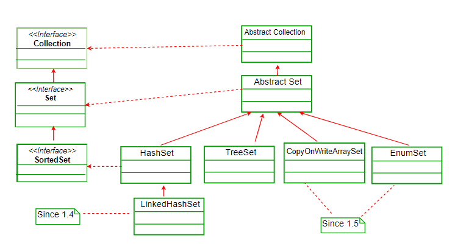
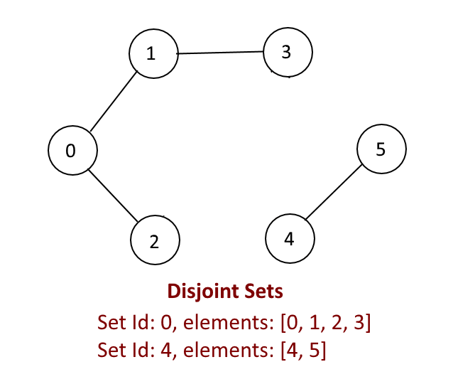

# Set

<!-- MarkdownTOC -->

- [HashSet Class](#hashset-class)
  - [Constructor](#Constructor)
  - [Methods in HashSet](#methods-in-hashSet)
- [SortedSet Interface](#sortedset-interface)
  - [NavigableSet Interface](#navigableset-interface)
  - [TreeSet Class](#treeset-class)
    - [Constructor](#constructor)
    - [Special Methods in TreeSet](#special-methods-in-treeSet)
- [Techniques in Interview](#techniques-in-nterview)
  - [Union Find (Disjoint Set)](#union-find-disjoint-set)
- [Reference](#reference)

<!-- /MarkdownTOC -->

Interface _Set_ in Java defines a collection that contains no duplicate elements. More formally, sets contain no pair of elements `e1` and `e2` such that `e1.equals(e2)`, and at most one `null` element. It inherits from the _Collection_ interface.

The hierarchy of _Set_ classes is



## HashSet Class

This class implements the _Set_ interface, backed by a hash table (actually a _HashMap_ instance). It makes no guarantees as to the iteration order of the set; in particular, it does **not** guarantee that the order will remain constant over time. This class permits the `null` element.

**Note that this implementation is not synchronized.** 

- This class offers **constant** time performance for the basic operations, including _add_, _remove_, _contains_, _isEmpty_ and _size_, assuming the hash function disperses the elements properly among the buckets. 

- Iterating over this set requires time proportional to the sum of the HashSet instance's size (the number of elements) plus the "capacity" of the backing HashMap instance (the number of buckets). Thus, it's very important not to set the initial capacity too high (or the load factor too low) if iteration performance is important.

### Constructor

```java
// Constructs a new, empty set; the backing HashMap instance has default initial capacity (16) and load factor (0.75).
HashSet set = new HashSet();

// Constructs a new set containing the elements in the specified collection.
HashSet set = new HashSet(Collection<? extends E> c);

// Constructs a new, empty set; the backing HashMap instance has the specified initial capacity and default load factor (0.75).
HashSet set = new HashSet(int initialCapacity);

// Constructs a new, empty set; the backing HashMap instance has the specified initial capacity and the specified load factor.
HashSet set = new HashSet(int initialCapacity, float loadFactor)
```

`load factor = Number of stored elements in the table / Size of the hash table`

### Methods in HashSet

- _boolean add(E e)_: adds the specified element to this set if it is not already present.

```java
HashSet<String> hs = new HashSet<>();
for (int i = 0; i < 10; i++)
  hs.add(String.valueOf(i));    // containing [0, 1, 2, 3, 4, 5, 6, 7, 8, 9], no guarantee in order
```

- _void	clear()_: removes all of the elements from this set.

```java
HashSet<String> hs = new HashSet<>();
for (int i = 0; i < 10; i++)
  hs.add(String.valueOf(i));
hs.clear();
```

- _boolean contains(Object o)_: returns true if this set contains the specified element.

```java
HashSet<String> hs = new HashSet<>();
for (int i = 0; i < 10; i++)
  hs.add(String.valueOf(i));
hs.contains("5");         // returns true
hs.contains("50");        // returns false
```

- _boolean isEmpty()_: returns true if this set contains no elements.

```java
HashSet<String> hs = new HashSet<>();
hs.isEmpty();                      // returns true
for (int i = 0; i < 10; i++)
  hs.add(String.valueOf(i));
hs.isEmpty();                     // returns false
```

- _boolean remove(Object o)_: removes the specified element from this set if it is present.

```java
HashSet<String> hs = new HashSet<>();
for (int i = 0; i < 10; i++)
  hs.add(String.valueOf(i));    // containing [0, 1, 2, 3, 4, 5, 6, 7, 8, 9], no guarantee in order
hs.remove("5")                  // containing [0, 1, 2, 3, 4, 6, 7, 8, 9], no guarantee in order
```

- _int size()_: returns the number of elements in this set (its cardinality).

```java
HashSet<String> hs = new HashSet<>();
for (int i = 0; i < 10; i++)
  hs.add(String.valueOf(i));
hs.size();          // returns 10
```

- _Iterator<E> iterator()_: returns an iterator over the elements in this set.

```java
HashSet<String> hs = new HashSet<>();
for (int i = 0; i < 10; i++)
  hs.add(String.valueOf(i));
Iterator<String> it = hs.iterator();
while (it.hasNext())
  System.out.println(it.next());      // [9, 8, 7, 6, 5, 4, 3, 2, 1, 0]
```

## SortedSet Interface

A _Set_ (inherits _Set_ interface) that further provides a total ordering on its elements. The elements are ordered using their natural ordering, or by a _Comparator_ typically provided at sorted set creation time. The set's iterator will traverse the set in ascending element order. Several additional operations are provided to take advantage of the ordering.

### NavigableSet Interface

A SortedSet extended with navigation methods reporting closest matches for given search targets. Methods lower, floor, ceiling, and higher return elements respectively less than, less than or equal, greater than or equal, and greater than a given element, returning null if there is no such element.

### TreeSet Class

A NavigableSet implementation based on a TreeMap. The elements are ordered using their natural ordering, or by a Comparator provided at set creation time, depending on which constructor is used.

The inheritance order is `SortedSet <- NavigableSet <- TreeSet`.

**Note that this implementation is not synchronized.** To synchronize it, 

```java
TreeSet ts = new TreeSet();
Set syncSet = Collections.synchronziedSet(ts); 
```

Some features of TreeSet are:

- Objects in a TreeSet are stored in a sorted and ascending order.
- TreeSet does not preserve the insertion order of elements but elements are sorted by keys.
- TreeSet is basically implementation of a self-balancing binary search tree like Red-Black Tree. Therefore operations like _add_, _remove_ and _search_ take `O(lgn)` time. And operations like printing n elements in sorted order takes `O(n)` time.

#### Constructor

```java
// Constructs a new, empty tree set, sorted according to the natural ordering of its elements.
TreeSet ts = new TreeSet();
// Constructs a new tree set containing the elements in the specified collection, sorted according to the natural ordering of its elements.
TreeSet ts = new TreeSet(Collection<? extends E> c);
// Constructs a new, empty tree set, sorted according to the specified comparator.
TreeSet ts = new TreeSet(Comparator<? super E> comparator);
// Constructs a new tree set containing the same elements and using the same ordering as the specified sorted set.
TreeSet ts = new TreeSet(SortedSet<E> s);
```

#### Special Methods in TreeSet

- _E ceiling(E e)_: Returns the least element in this set greater than or equal to the given element, or null if there is no such element.

```java
TreeSet<String> ts = new TreeSet<>();
for (int i = 0; i < 10; i++)
  ts.add(String.valueOf(i*10));
ts.ceiling("24");                // return 30
```

- _E floor(E e)_: Returns the greatest element in this set less than or equal to the given element, or null if there is no such element.

```java
TreeSet<String> ts = new TreeSet<>();
for (int i = 0; i < 10; i++)
  ts.add(String.valueOf(i*10));
ts.floor("24");                // return 20
```

- _Iterator<E> descendingIterator()_: Returns an iterator over the elements in this set in descending order.

```java
TreeSet<String> ts = new TreeSet<>();
for (int i = 0; i < 10; i++)
  ts.add(String.valueOf(i));
Iterator<String> it = ts.descendingIterator();
while (it.hasNext())
  System.out.println(it.next());
```

- _E higher(E e)_: Returns the least element in this set strictly greater than the given element, or null if there is no such element.

```java
TreeSet<String> ts = new TreeSet<>();
for (int i = 0; i < 10; i++)
  ts.add(String.valueOf(i));
ts.higher("5");                // return 6
```

- _E last()_: Returns the last (highest) element currently in this set.

```java
TreeSet<String> ts = new TreeSet<>();
for (int i = 0; i < 10; i++)
  ts.add(String.valueOf(i));
ts.last();                // return 9
```

- _E lower(E e)_: Returns the greatest element in this set strictly less than the given element, or null if there is no such element.

```java
TreeSet<String> ts = new TreeSet<>();
for (int i = 0; i < 10; i++)
  ts.add(String.valueOf(i));
ts.lower("5");                // return 4
```

- _E pollFirst()_ and _E pollLast()_: Retrieves and removes the first (lowest) / the last (highest) element, or returns null if this set is empty.

```java
TreeSet<String> ts = new TreeSet<>();
for (int i = 0; i < 10; i++)
  ts.add(String.valueOf(i));
ts.pollFirst();                // return 0
ts.pollLast();                 // return 9
```

- _SortedSet<E>	subSet(E fromElement, E toElement)_: Returns a view of the portion of this set whose elements range from fromElement, inclusive, to toElement, exclusive.

```java
TreeSet<String> ts = new TreeSet<>();
for (int i = 0; i < 10; i++)
  ts.add(String.valueOf(i));
ts.subSet("2", "8");           // return [2, 3, 4, 5, 6, 7] 
```

- _SortedSet<E>	headSet(E toElement)_ and _SortedSet<E>	headSet(E toElement, boolean inclusive)_: Returns a view of the portion of this set whose elements are strictly less than toElement.

```java
TreeSet<String> ts = new TreeSet<>();
for (int i = 0; i < 10; i++)
  ts.add(String.valueOf(i));
ts.headSet("8");           // return [0, 1, 2, 3, 4, 5, 6, 7]
```

- _SortedSet<E>	tailSet(E fromElement)_ and _NavigableSet<E>	tailSet(E fromElement, boolean inclusive)_: Returns a view of the portion of this set whose elements are greater than (or equal to, if inclusive is true) fromElement.

```java
TreeSet<String> ts = new TreeSet<>();
for (int i = 0; i < 10; i++)
  ts.add(String.valueOf(i));
ts.tailSet("5");           // return [5, 6, 7, 8, 9]
```

## Techniques in Interview

_HashSet_ is usually used to store processed values, like Two Sum question, and visited nodes in graph for BFS.

### Union Find (Disjoint Set)



## Reference

- <https://docs.oracle.com/javase/8/docs/api/java/util/Set.html>
- <https://docs.oracle.com/javase/8/docs/api/java/util/NavigableSet.html>
- <https://docs.oracle.com/javase/8/docs/api/java/util/HashSet.html>
- <https://docs.oracle.com/javase/8/docs/api/java/util/TreeSet.html>
- <https://docs.oracle.com/javase/8/docs/api/java/util/SortedSet.html>
- <https://www.geeksforgeeks.org/hashset-in-java/>
- <https://en.wikipedia.org/wiki/Disjoint-set_data_structure>
